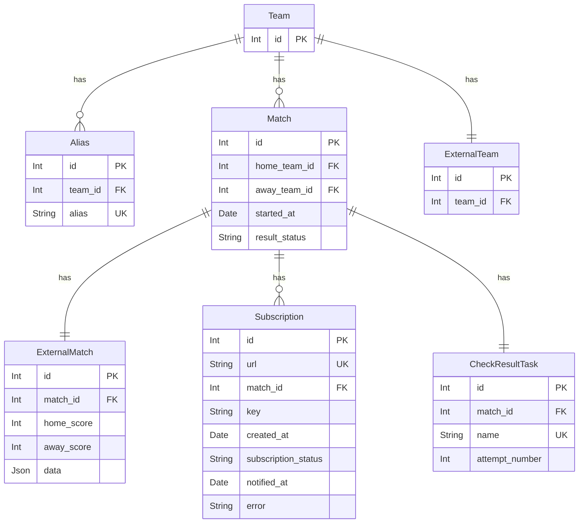
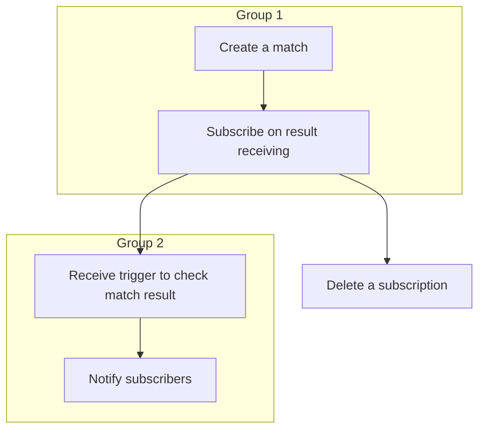
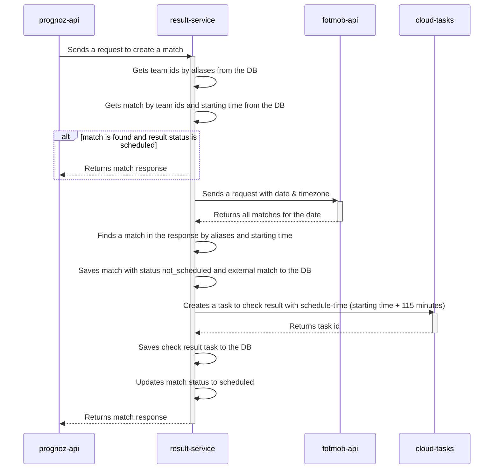
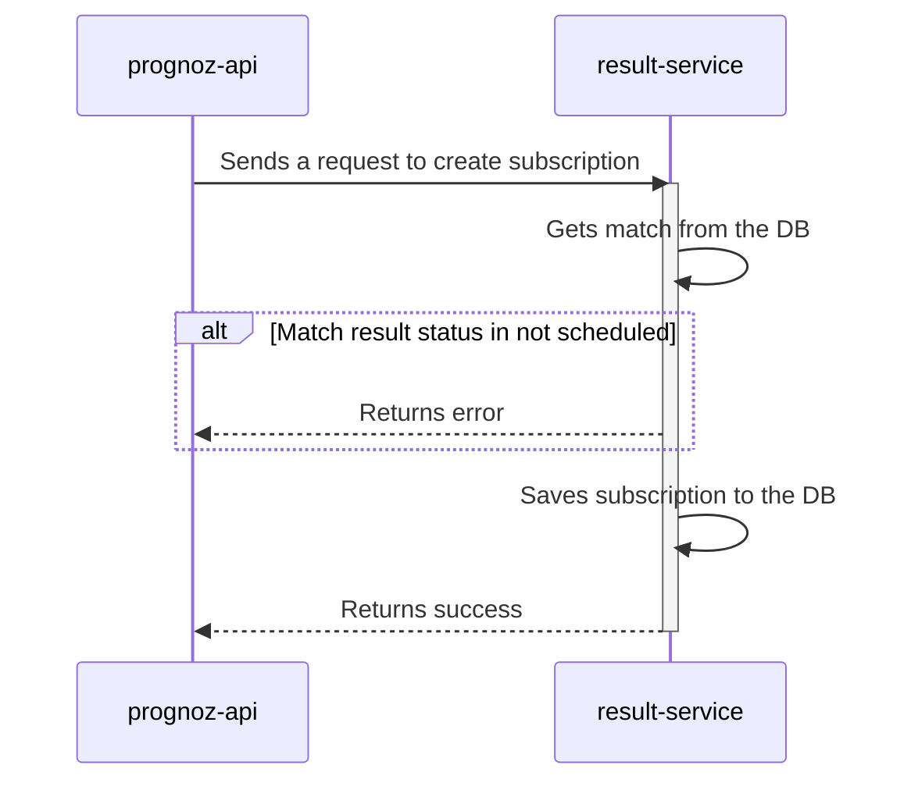
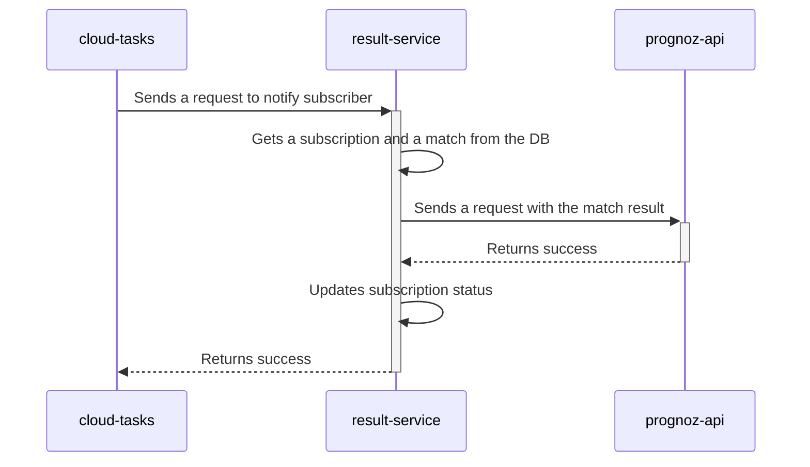
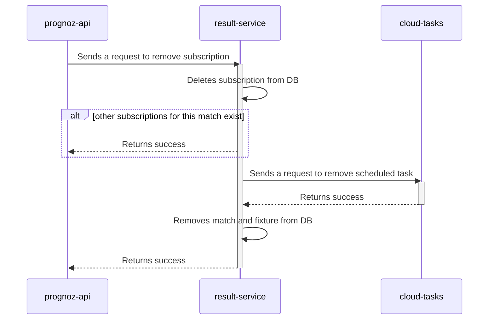

# football-result-service

## General Info

The purpose of this service is to make the life of administrators of football sites easier. 
Instead of monitoring football matches and adding results manually, their apps can use the webhook to receive results automatically.
`result-service` is created for **prognoz** project ([web-app](https://github.com/andrewshostak/prognoz_web_app), [api](https://github.com/andrewshostak/prognoz_api)), but not restricted to only it. 
Feel free to use this service for your needs.

## Technical implementation

### Characters

(Integration with `prognoz` project as an example)

- Football Result Service / `result-service` - This service.
- External Results API (Fotmob) / `fotmob-api` - The source of the football matches results.
- Prognoz API Server / `prognoz-api` - The service that wants to receive the results.
- Google Cloud Tasks / `cloud-tasks` - The service that schedules tasks to check match results and notify subscribers.

### Data persistence

`result-service` has a **relational database**. It is visually represented below:

Table names are pluralized. The tables `teams`, `aliases`, `external-teams` are pre-filled with the data of `fotmob-api`.

#### Description of possible match `result_status` values:

| `result_status`    | Description                                                                                                                                           |
|--------------------|-------------------------------------------------------------------------------------------------------------------------------------------------------|
| `not_scheduled`    | Match is created, but fixture creation or task scheduling fails                                                                                       |
| `scheduled`        | Match is created and a task is scheduled. If there was an attempt to get a result but a match was not ended the status `scheduled` remains unchanged. |
| `scheduling_error` | An attempt to reschedule task was unsuccessful.                                                                                                       |
| `received`         | Match result is received.                                                                                                                             |
| `api_error`        | Request to fotmob-api to get match result was unsuccessful.                                                                                           |
| `cancelled`        | Received a status from fotmob-api indicates that match was canceled. No new task is rescheduled.                                                      |

#### Description of possible subscription `subscription_status` values:

| `subscription_status` | Description                                                          |
|-----------------------|----------------------------------------------------------------------|
| `pending`             | Subscription is created, but match result is not yet received.       |
| `scheduling_error`    | Attempt to create a task was unsuccessful.                           |
| `successful`          | Subscriber successfully notified. Column `notified_at` gets a value. |
| `subscriber_error`    | Subscriber returned an error. Column `error` gets a value.           |

## Flow diagrams

### Overall

### Create a match

### Subscribe on result receiving

### Receive trigger to check match result

### Notify subscribers

### Delete a subscription

### Authorization

`prognoz-api` => `result-service`
1) A secret key is generated, hashed and set to env variables
2) `prognoz-api` attaches secret key to requests to `result-service`
3) `result-service` has a middleware that checks presence and validity of secret-key

`result-service` => `prognoz-api`
1) When `prognoz-api` creates a subscription it sends a secret-key
2) Secret-key is saved in `subscriptions` table for each subscription  
3) When `result-service` calls subscription `url` it attaches secret-key to the request

### Back-fill aliases data

To back-fill aliases data a separate command is created. The command description:
- Accepts dates as a parameter
- Command has predefined list of league and country names (for example: Premier League - Ukraine, La Liga - Spain, etc.)
- For each date param calls `fotmob-api`s `matches` endpoint
- Extracts team names from the matches list
- For each team the command does the next actions in database 
  - checks if `alias` already exists
  - if not, creates a `team`, `alias`, `external_team` in transaction

### Implementation TODO
- [X] Connect to supabase from datagrip
- [X] Update database migrations: include tasks table & new statuses 
- [X] Add a command to run migrations
- [X] Run migrations on supabase from locally-running command
- [X] Remove scheduler related code
- [X] Configure google cloud run: create project, region, cloud run service
- [X] Deploy service to cloud run
- [X] Configure cloud run settings
- [X] Configure google cloud tasks: region, two queues
- [X] Start service locally with launching cloud task client
- [X] Modify existing POST /matches
- [X] Modify existing POST /subscriptions
- [X] Implement client methods to interact with google cloud tasks API
    - [X] Create a new check-result task
    - [X] Create a new notify-subscriber task
    - [X] Remove check-result task
- [X] Verify match creation flow works
- [X] Modify existing DELETE /subscriptions
- [X] Verify subscription deletion flow works
- [X] Create a new endpoint to be called by cloud task for checking match result
- [X] Create a new endpoint to be called by cloud task for notifying subscriber
- [ ] Migrate to fotmob API
  - [ ] Modify backfill aliases command
    - [X] Create client method to call fotmob matches list (by date)
    - [X] Update command logic to accept date, update leagues, update mapping
  - [ ] Modify Match creation flow 
    - [ ] Update football_api_fixtures table: rename to external_matches, add score_home, score_away
    - [ ] Create client method to call fotmob match details (by id)
    - [ ] Update match creation endpoint
    - [ ] Delete football_api_team table and its references
- [ ] Include signed requests & validate google-auth middleware
- [ ] Find a solution for same-time results (i.e. do not process tasks concurrently)
- [ ] Add created_at / updated_at columns

// TODO: use case what happens if match sent starting time is different from match football api starting time
