# football-result-service

## General Info

The purpose of this service is to make the life of administrators of football sites easier. 
Instead of monitoring football matches and adding results manually, their apps can use the webhook to receive results automatically.
`result-service` is created for **prognoz** project ([web-app](https://github.com/andrewshostak/prognoz_web_app), [api](https://github.com/andrewshostak/prognoz_api)), but not restricted to only it. 
Feel free to use this service for your needs.

## Technical implementation

### Characters

(Integration with `prognoz` project as an example)

- Football Result Service / `result-service` - This service.
- Football Results API / `football-api` - The source of the football matches results: [documentation](https://www.api-football.com/documentation-v3).
- Prognoz API Server / `prognoz-api` - The service that wants to receive the results.
- Google Cloud Tasks / `cloud-tasks` - The service that schedules tasks to check match results and notify subscribers.

### Data persistence

`result-service` has a **relational database**. It is visually represented below:

```mermaid
erDiagram
    Team {
        Int id PK
    }
    
    Alias {
        Int id PK
        Int team_id FK
        String alias UK 
    }
    
    Match {
        Int id PK
        Int home_team_id FK
        Int away_team_id FK
        Date started_at
        String result_status
    }
    
    FootballAPIFixture {
        Int id PK
        Int match_id FK
        Json data
    }
    
    Subscription {
        Int id PK
        String url UK
        Int match_id FK
        String key
        Date created_at
        String subscription_status
        Date notified_at
        String error
    }
    
    FootballAPITeam {
        Int id PK
        Int team_id FK
    }
    
    ResultTask {
        String name PK
        Int match_id FK
    }
    
    Team ||--o{ Alias : has 
    Team ||--o{ Match : has
    Match ||--|| FootballAPIFixture : has
    Match ||--o{ Subscription : has
    Team ||--|| FootballAPITeam : has
    Match ||--|| ResultTask : has
```

Table names are pluralized. The tables `teams`, `aliases`, `football_api_teams` are pre-filled with the data of `prognoz-api` and `football-api`.

#### Description of possible match `result_status` values:

| `result_status`    | Description                                                                                                                                                                                |
|--------------------|--------------------------------------------------------------------------------------------------------------------------------------------------------------------------------------------|
| `not_scheduled`    | Match is created, but a task is not yet scheduled.                                                                                                                                         |
| `scheduled`        | Match is created and a task is scheduled. If there was an attempt to get a result but a match was not ended the status `scheduled` remains unchanged.                                      |
| `scheduling_error` | Match is created, but an attempt to create a task was unsuccessful.                                                                                                                        |
| `received`         | Match result is received.                                                                                                                                                                  |
| `api_error`        | Request to football-api was unsuccessful.                                                                                                                                                  |
| `cancelled`        | Means the next status from football-api is received: "Match Suspended", "Match Postponed", "Match Cancelled", "Match Abandoned", "Technical Loss", "WalkOver". No new task is rescheduled. |

#### Description of possible subscription `subscription_status` values:

| `subscription_status` | Description                                                          |
|-----------------------|----------------------------------------------------------------------|
| `pending`             | Subscription is created, but match result is not yet received.       |
| `scheduling_error`    | Attempt to create a task was unsuccessful.                           |
| `successful`          | Subscriber successfully notified. Column `notified_at` gets a value. |
| `subscriber_error`    | Subscriber returned an error. Column `error` gets a value.           |

## Flow diagrams

### Overall

### Create a match

Open questions:
- what if match is found

### Subscribe on result receiving

### Receive trigger to check match result

### Notify subscribers

### Delete a subscription

### Authorization

`prognoz-api` => `result-service`
1) A secret key is generated, hashed and set to env variables
2) `prognoz-api` attaches secret key to requests to `result-service`
3) `result-service` has a middleware that checks presence and validity of secret-key

`result-service` => `prognoz-api`
1) When `prognoz-api` creates a subscription it sends a secret-key
2) Secret-key is saved in `subscriptions` table for each subscription  
3) When `result-service` calls subscription `url` it attaches secret-key to the request

`result-service` => `football-api`
1) An env variable `RAPID_API_KEY` is stored in env variables and attached to each request 

### Back-fill aliases data

To back-fill aliases data a separate command is created. The command description:
- Accepts season as a parameter
- Command has predefined list of league and country names (for example: Premier League - Ukraine, La Liga - Spain, etc.)
- Calls `football-api`s `leagues` endpoint with `season` param
- Extracts appropriate league ids from the response of `league` endpoint
- Concurrently calls `teams` endpoint with the `season` and `league` param
- For each team the command does the next actions in database 
  - checks if `alias` already exists
  - if not, creates a `team`, `alias`, `football_api_team` in transaction

### Implementation TODO
- [X] Connect to supabase from datagrip
- [X] Update database migrations: include tasks table & new statuses 
- [X] Add a command to run migrations
- [X] Run migrations on supabase from locally-running command
- [X] Remove scheduler related code
- [ ] Configure google cloud: create project, cloud run service, two queues.
- [ ] Create client methods to interact with google cloud tasks API
  - [ ] Create a new task
  - [ ] Remove existing task
- [ ] Start service locally with launching cloud task client
- [ ] Create a new endpoint to be called by cloud task for checking match result
- [ ] Create a new endpoint to be called by cloud task for notifying subscriber
- [ ] Modify existing POST /matches
- [ ] Modify existing POST /subscriptions
