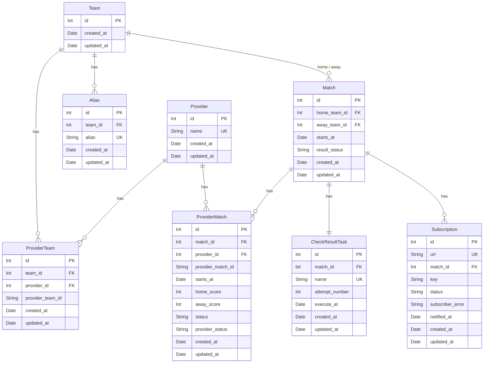

# Proposed DB Changes

## 1. New table: `providers`

A new table to register supported result providers.

**Fields:**
- `id` — surrogate primary key (auto-increment)
- `name` — provider name, unique (e.g. `fotmob`)

**Why:** Makes provider identity a first-class concept in the schema instead of a free-form string. Foreign keys from `provider_teams` and `provider_matches` reference this table, so only registered providers can be used.

**Initial data:** one row — `fotmob`.

---

## 2. Replace `external_teams` with `provider_teams`

The current `external_teams` table has two design problems:
- Its `id` column is declared as auto-increment but is actually set to the fotmob team ID — the surrogate key is secretly an external ID.
- The unique constraint on `team_id` locks the table to one provider per team forever.

**New table: `provider_teams`**

**Fields:**
- `id` — true surrogate primary key (auto-increment)
- `team_id` — foreign key to `teams`
- `provider_id` — foreign key to `providers`
- `provider_team_id` — the provider's own ID for this team (stored as string to support both integer and UUID-style IDs across providers)

**Unique constraints:**
- `(team_id, provider_id)` — one row per team per provider
- `(provider_id, provider_team_id)` — a provider's team ID is unique within that provider

**Why:** A team like Real Madrid can now have a fotmob ID and a sofascore ID stored simultaneously. The `id` column is an honest surrogate key. Provider identity is enforced via a foreign key rather than a raw string.

---

## 3. Replace `external_matches` with `provider_matches`

The current `external_matches` table has the same two problems as `external_teams`:
- Its `id` column is secretly the fotmob match ID, not a surrogate key.
- The unique constraint on `match_id` allows only one provider's data per match.

Additionally, `starts_at` is missing — provider-reported match time belongs here alongside scores and status.

**New table: `provider_matches`**

**Fields:**
- `id` — true surrogate primary key (auto-increment)
- `match_id` — foreign key to `matches`
- `provider_id` — foreign key to `providers`
- `provider_match_id` — the provider's own ID for this match (stored as string to support both integer and UUID-style IDs across providers)
- `starts_at` — match starting time as reported by this provider
- `home_score` — home team score as reported by this provider
- `away_score` — away team score as reported by this provider
- `status` — normalized match status (e.g. `not_started`, `in_progress`, `finished`)
- `provider_status` — raw status value as received from the provider, useful for debugging unknown or unexpected statuses

**Unique constraints:**
- `(match_id, provider_id)` — one row per match per provider
- `(provider_id, provider_match_id)` — a provider's match ID is unique within that provider

**Why:** Multiple providers' data for the same match can be stored in parallel, enabling fallback and cross-provider comparison. The `starts_at` field captures the time each provider reports, which may differ between providers or from the admin-entered time. Provider identity is enforced via foreign key.

**Note on `matches.starts_at`:** The `starts_at` column remains in `matches` — it is needed as the deduplication key (`unique(home_team_id, away_team_id, starts_at)`) and for scheduling result-check tasks. Its value comes from the provider, not from the admin's manually entered time (the admin's time is only used as a date hint to query the provider).

---

## 4. Add `created_at` and `updated_at` to all tables

Every table should carry timestamps so there is a consistent audit trail of when rows were created and last modified.

**Tables that need both columns added:**
- `providers` (new table)
- `teams`
- `aliases`
- `matches`
- `provider_teams` (replaces `external_teams`)
- `provider_matches` (replaces `external_matches`)
- `check_result_tasks`

**Tables that already have `created_at` but are missing `updated_at`:**
- `subscriptions`
- `check_result_tasks`

**Fields:**
- `created_at` — set once at insert time, never changed
- `updated_at` — set at insert time and updated automatically on every modification

---

## Proposed Schema Diagram

